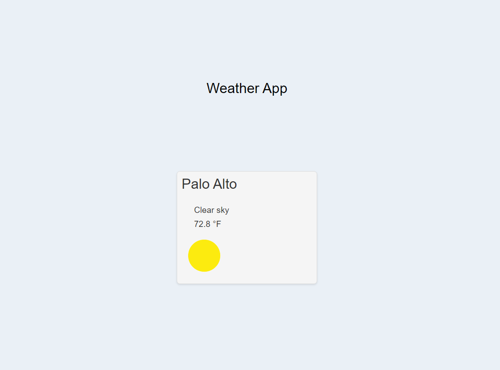

# Weather App

🌤️

This is a simple web application that allows users to check the weather for a specific city. It provides real-time weather information such as temperature and weather description.

## Usage

1. Enter the name of a city in the input box.
2. Click the "Submit" button or press Enter.
3. The application will fetch weather data for the specified city and display it.

## Preview



## Technologies Used

- HTML
- CSS
- JavaScript
- [Weatherbit API](https://www.weatherbit.io/api) for weather data

## Installation

To run this application locally, follow these steps:

1. Clone the repository:
```bash
git clone https://github.com/Frankelly-Guzman/Weather-App.git
cd Weather-App
```

2. Open the `index.html` file in your web browser to use the Weather App.

## Customization

You can customize the appearance of the application by modifying the `styles.css` file. Additionally, you can enhance the functionality by exploring the JavaScript code in the `app.js` file.

## Credits

- Weather icons provided by [Weatherbit](https://www.weatherbit.io/static/img/icons/)
- Weather data provided by [Weatherbit API](https://www.weatherbit.io/api)

## Author

This Weather App was created by Frankelly Guzman.

If you have any questions or feedback, please feel free to [contact me](mailto:FrankellyRGuzman@gmail.com).

Enjoy checking the weather with the Weather App!
